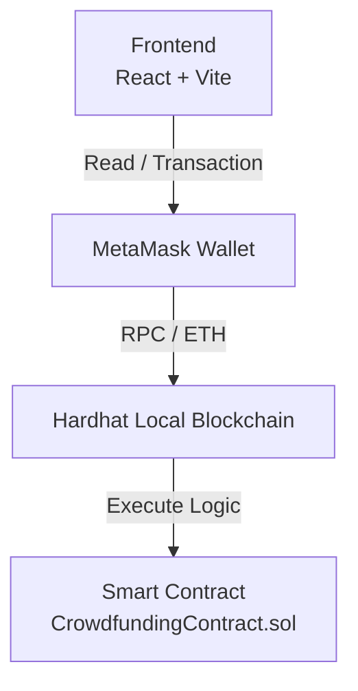

# ChainFund – Decentralized Crowdfunding Protocol for UMKM

ChainFund adalah platform penggalangan dana terdesentralisasi (**DApp**) yang dirancang untuk pendanaan komersial dan investasi produktif pada sektor UMKM maupun startup.

Berbeda dengan platform donasi sosial konvensional, ChainFund menerapkan **transparansi penuh berbasis blockchain Ethereum** melalui **Smart Contract**. Seluruh alokasi modal, pencairan dana, dan hak pengembalian investasi dijalankan secara otomatis tanpa perantara pihak ketiga.

---

## 1. Deskripsi Sistem

Sistem ini memiliki dua peran utama (*role identification*) yang ditentukan secara dinamis berdasarkan alamat dompet kripto (**MetaMask Wallet Address**) tanpa mekanisme login konvensional.

### Founder Panel

Modul bagi pemilik usaha untuk:

* Mendaftarkan proposal proyek (*Initialize Entry*)
* Menentukan target pendanaan
* Mengatur durasi pendanaan (*lifespan*)
* Melakukan penarikan dana apabila target tercapai atau periode telah berakhir

### Investor Portfolio

Modul bagi investor untuk:

* Menjelajahi daftar proyek aktif (*Active Ledger*)
* Memberikan pendanaan menggunakan Ether (**ETH**)
* Melihat riwayat investasi pribadi
* Menggunakan fitur *Human Error Protection* berupa **Refund Window** dalam batas waktu tertentu setelah kontribusi

---

## 2. Arsitektur Sistem

Aplikasi menggunakan arsitektur **Single Page Application (SPA)** yang terhubung dengan jaringan blockchain lokal.



### Komponen Utama

#### Frontend Stack

* React.js
* Vite
* React Router DOM
* Vanilla CSS

#### Blockchain Development Stack

* Solidity
* Hardhat
* Ethers.js v6

---

## 3. Cara Menjalankan Project

Ikuti langkah berikut untuk menjalankan ekosistem ChainFund secara lokal.

### Prasyarat

* Node.js **v18+**
* Ekstensi browser **MetaMask**

---

### Langkah 1 — Menjalankan Blockchain Lokal (Hardhat)

Buka terminal pada folder root proyek:

```bash
cd crowdfunding-blockchain
```

Install seluruh dependensi:

```bash
npm install
```

Jalankan jaringan blockchain lokal:

```bash
npx hardhat node
```

> Terminal ini harus tetap berjalan selama aplikasi digunakan.

Salin salah satu **Private Key** akun uji coba yang muncul untuk diimpor ke MetaMask.

---

### Langkah 2 — Deploy Smart Contract

Buka terminal baru tanpa menutup terminal Hardhat.

Deploy contract ke jaringan lokal:

```bash
npx hardhat run scripts/deploy.js --network localhost
```

Setelah proses selesai:

* Salin alamat Smart Contract yang muncul
* Simpan ke:

```plaintext
frontend/src/contracts/contractAddress.js
```

---

### Langkah 3 — Menjalankan Frontend

Masuk ke folder frontend:

```bash
cd frontend
```

Install dependensi:

```bash
npm install
```

Jalankan aplikasi:

```bash
npm run dev
```

Buka di browser:

```plaintext
http://localhost:5173
```

---

### Langkah 4 — Konfigurasi MetaMask

Buka MetaMask lalu tambahkan jaringan berikut:

| Parameter    | Value                   |
| ------------ | ----------------------- |
| Network Name | Localhost               |
| RPC URL      | `http://127.0.0.1:8545` |
| Chain ID     | `31337`                 |

Kemudian:

1. Import akun menggunakan **Private Key**
2. Klik **Connect Wallet** pada website
3. Mulai simulasi transaksi crowdfunding

---

## 4. Workflow Singkat

```text
Founder → Create Campaign
          ↓
Investor → Fund Project
          ↓
Smart Contract → Store Transaction
          ↓
Founder → Withdraw / Investor → Refund
```
